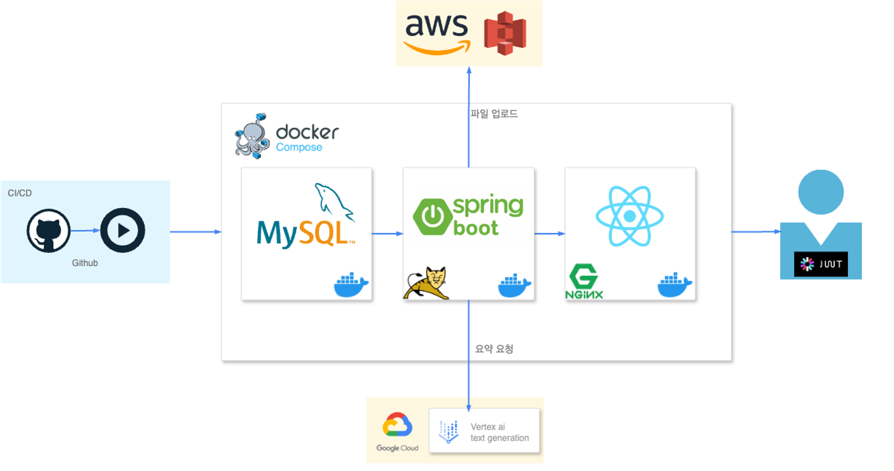

# job-of-better

취업 컨설팅을 위한 웹 사이트로, 교육생과 프로그램 관리 및 학생 모집 기능을 제공합니다.

> [!Important]
> 프로젝트 루트 경로의 `.env` 파일을 통해 DB 비밀번호, JWT 비밀키 등을 관리합니다.  
> 텍스트 에디터를 사용하여 이를 수정한 후 웹 서버 설치를 진행해 주세요.


## Features

- 인증
  - 로그인
  - 회원가입
- 학생
  - 회사, 교육 프로그램 선택
  - 자기소개서 입력
  - 이력서 입력
  - 학생 마이페이지
- 회사
  - 학생 관리
  - 교육 프로그램 관리
  - 회사 마이페이지

## System Requirements

- Mac OS: macOS 10.9 (Mavericks) 이상
- Linux: 커널 버전 3.10 이상을 권장(Ubuntu 18.04 LTS 이상, CentOS 7 이상, Debian 9 이상 등)

## Getting Started

### 사전 요구사항

> [!Note]
> 이 프로젝트는 Docker와 Docker Compose를 사용하여 로컬 환경에서 쉽게 실행할 수 있도록 구성되어 있습니다.  
> 다음 단계를 따라 프로젝트를 설정하고 실행하세요.   
> Docker 설치 방법은 [Docker 공식 문서](https://docs.docker.com/desktop/)를 참조하세요.
 
### **설치 및 실행 단계**

1. **프로젝트 클론**

   Git을 사용하여 이 프로젝트를 로컬 시스템으로 클론합니다.
    ```bash
    git clone https://github.com/dealim/job-of-better
    cd job-of-better
    ```

1. **환경변수 설정**
   
   프로젝트 루트 경로에 `.env` 파일을 생성한뒤 다음과 같이 입력합니다.
   ```
   ## required ##
   
    MYSQL_URL=mysql-server:3306
    MYSQL_ROOT_PASSWORD=0000
    MYSQL_DATABASE=JOB_OF_BETTER_DB
    MYSQL_USER=USER
    MYSQL_PASSWORD=0000
    
    REACT_APP_ENV=production
    REACT_APP_PROXY=https://springboot-app:9090
    
    JWT_SECRET_KEY=<생성된 JWT Secret Key>

   ## optional ##
   
    #GCP에서 받은 서비스키는 프로젝트 root 경로에 위치시킨뒤, 파일명을 환경변수로 설정합니다.
    VERTEX_AI_SERVICE_KEY_FILENAME=<GCP vertex-ai 서비스 키(json) 파일명> 

    AWS_BUCKET_NAME=<AWS BUCKET NAME>
    AWS_ACCESS_KEY=<AWS ACCESS KEY>
    AWS_SECRET_KEY=<AWS SECRET KEY>
    AWS_REGION=<AWS REGION>
   ```
    - JWT 키는 최소 32바이트 길이를 권장합니다. 비밀키 생성에는 [password generator](https://passwords-generator.org/)를 사용할 수 있습니다.
    - 이 프로젝트는 VERTEX-AI 와 AWS 버킷을 사용하고 있습니다.  
    - 키가 없어도 프로젝트를 실행해 볼 수 있으나, 파일 업로드와 ai 교육 요약 기능이 제한됩니다.
5. **Docker 이미지 빌드 및 컨테이너 실행**

   프로젝트 루트경로로 이동하여 Docker Compose를 사용해 서비스를 빌드하고 실행합니다.
    ```bash
    docker-compose up --build
    ```
   빌드가 완료되고, Spring Boot, React, MySQL 총 세 개의 컨테이너가 실행됩니다.

6. **웹사이트 접속**
   
   브라우저를 열고 `http://localhost:3000`으로 접속합니다. 애플리케이션의 홈페이지가 표시됩니다.

## Architecture


## Folder Structure

```
client/src
├── apis                                    # 사용할 api 들
├── assets                                  # css, scss, plugin, font
│   ├── css
│   ├── demo
│   ├── fonts
│   ├── img
│   │   ├── brand
│   │   ├── icons
│   │   │   └── common
│   │   └── theme
│   ├── plugins
│   │   └── nucleo
│   │       ├── css
│   │       └── fonts
│   └── scss
├── components                              # 사용 컴포넌트
│   ├── Alert                        
│   ├── Buttons
│   ├── Card
│   ├── Chart
│   ├── Editor
│   ├── Footer
│   ├── FormGroup
│   ├── HOC
│   ├── Headers
│   ├── Infos
│   │   └── numbers
│   ├── Modal
│   ├── Navbars
│   ├── Notification
│   ├── Picker
│   ├── Plugin
│   ├── PopUp
│   ├── Sidebar
│   └── Viewer
├── contexts                               
├── layouts                             # auth, company, user 권한별 레이아웃
├── theme                               # 테마 관련
├── variables
└── views
    ├── auth
    ├── common
    ├── company
    │   ├── memberList
    │   └── program
    └── user
        └── program
        
server/src
├── main
│   ├── META-INF
│   ├── generated
│   ├── java
│   │   └── site
│   │       └── dealim
│   │           └── jobconsulting
│   │               ├── config
│   │               ├── controller
│   │               ├── domain
│   │               ├── dto
│   │               ├── error
│   │               │   └── exception
│   │               ├── mapper              # mybatis용 mapper 인터페이스
│   │               ├── prop
│   │               ├── scheduler           # 회원 상태 업데이트용 스케줄러
│   │               ├── security
│   │               │   ├── custom
│   │               │   └── jwt       # jwt 구현 코드
│   │               │       ├── constants
│   │               │       ├── filter
│   │               │       └── provider
│   │               ├── service
│   │               └── util
│   └── resources
│       ├── mybatis
│       │   └── mapper
│       └── static
└── test
    └── java
        └── site
            └── dealim
                └── jobconsulting
                
database/
└── sql-scripts         # DB 서버 컨테이너 초기 시작시 실행할 script
```

## Roles
### 김지창
- JWT 인증 시스템 구성
- 교육생 관리, 프로그램 관리 페이지
- 코드 통합 및 배포
- LLM(Google Vertex AI)을 활용한 자소서 평가 및 교육 요약

### 이시영
- 기업 회원가입
- 기업 사용자 / 일반 사용자 - 대시보드, 자기소개서, 정보수정
- AWS 파일 업로드
- Swagger 적용
- 웹 프론트 테마 구성

## Videos
<table>
    <tr>
        <td>
            <a href="https://youtu.be/5Bj9rwyBnuU">User Sign-In</a>
        </td>
        <td>
            <a href="https://youtu.be/gIb45eP3YhQ">User Tutorial</a>
        </td>
    </tr>
    <tr>
        <td>
            <a href="https://youtu.be/zFr11jWISvg">Company Sign-In</a>
        </td>
        <td>
            <a href="https://youtu.be/6wHiJ9nOXBw">Company Tutorial</a>
        </td>
    </tr>
    <tr>
        <td>
            <a href="https://www.youtube.com/watch?v=SbM4iDwViMg">Presentation</a>
        </td>
    </tr>
</table>

## License
MIT License Copyright (c) 2024 dealim
